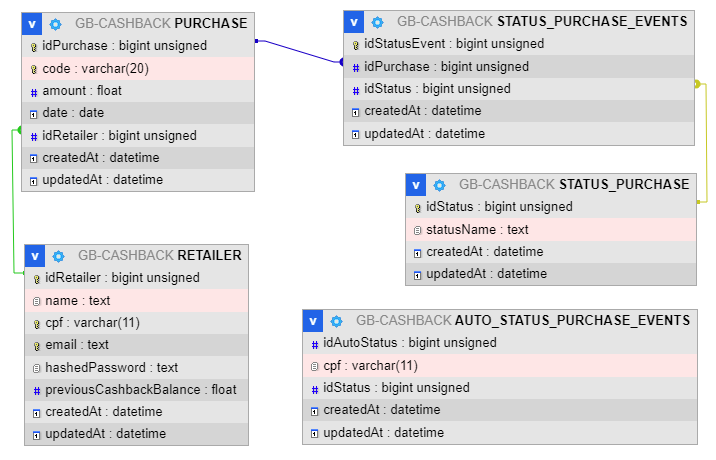
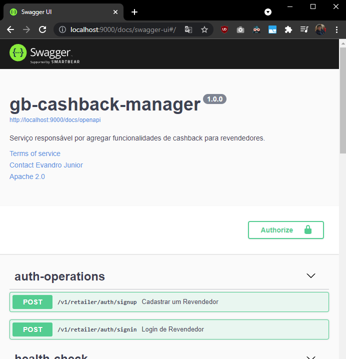
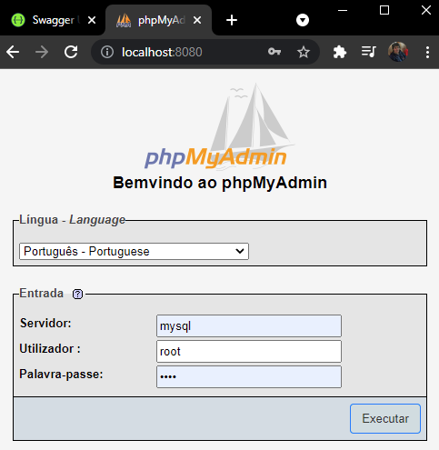
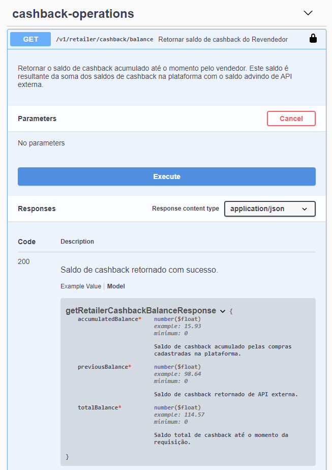
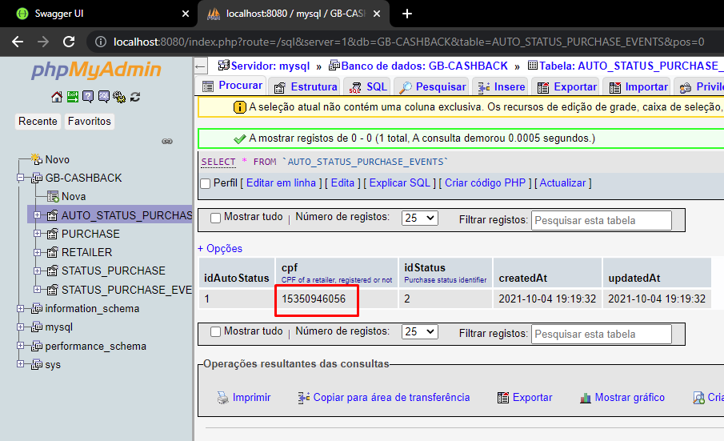
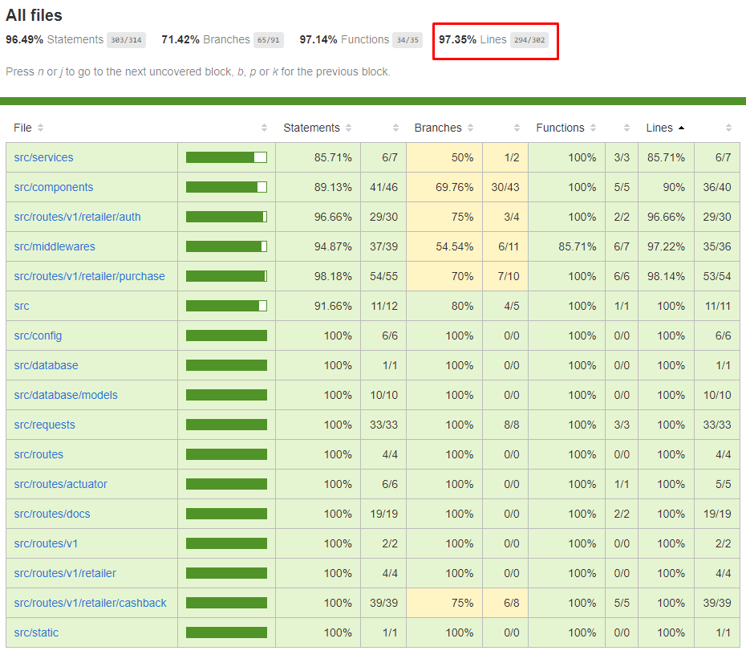

# gb-cashback-manager

+ Esta aplicação tem como objetivo prover as integrações necessárias para o funcionamento de uma plataforma voltada a cadastro de compras de revenderos e recompensa dos mesmos com cashback.

## Quais ferramentas foram utilizadas no desenvolvimento?

+ Como banco de dados relacional escolheu-se o `MySQL 8.0.26` por conta da facilidade de integração com a dependência `Sequelize`. Adotou-se utilizar um banco SQL principalmente por conta das relações que existem entre as entidades do projeto e a oportunidade de aproveitá-las para diminuir o trabalho de implementação.



+ Além disso também utilizou-se o `Node 14.17.3` para desenvolvimento do back-end, `Docker 20.10.8` para empacotamento da aplicação e o `phpMyAdmin 5.1.1` para alterações e trabalhos no banco de dados.

## Como iniciar os serviços?

+ Para iniciar a aplicação junto com a sua infraestrutura basta apenas ter o Docker e o Docker Compose instalados. No diretório raiz da aplicação, é possível contruir e iniciar os serviços com o comando:

```bash
docker-compose up -d
```

+ Para acompanhar logs da aplicação, use o comando:

```bash
docker-compose logs -f gb-cashback-manager
```

+ Já para iniciar os testes unitários do serviço, deve-se entrar no diretório do mesmo, instalar as suas dependências (pode demorar um pouco) com:

```bash
npm install
```

+ E depois entrar com o seguinte comando:

```bash
npm test
```
+ Para os testes unitários, utilizou-se mocks das estruturas de banco de dados, então não é preciso que o mesmo esteja disponível.

+ Também podemos encontrar a especificação da aplicação no seu swagger, acessando a URL (enquanto o serviço estiver ativo):

http://localhost:9000/docs/swagger-ui

  


  + E, se necessário for, acessar as tabelas do banco de dados pelo phpMyAdmin na URL:

  http://localhost:8080/

  

## Considerações sobre o desenvolvimento

+ Durante o desenvolvimento do serviço tomou-se algumas decisões sobre as features implementadas. Dentre elas, podemos destacar:

  - O endpoint de cadastro de revendedor cria uma entrada para o mesmo no banco e, também, realiza a chamada para o serviço externo de consulta de cashback. Notou-se que o serviço retorna valores diferentes de crédito para o mesmo revendedor, então decidiu-se guardar este valor e somá-lo com o saldo de cashback na plataforma, onde pode-se consultar no endpoint de Saldo de cashback:

  

  - Sobre o status de cadastro, optou-se por criar 3 tabelas para abstrair essa lógica. Uma primeira que faz a relação entre código do status e o mesmo, uma outra que registra eventos de alteração de status e uma última que mantém a lista de usuário que terão status automático atribuido ao cadastro da sua compra. Nesse caso, o usuário pode ser adicionado na tabela mesmo antes de ter se cadastrado.

  

## Features extras

 + Dentre as features extras, pode-se destacar: 
   - Testes unitários: utilizou-se mocks para excluir a dependência de banco de dados durante os testes. O resultado final, em cobertura, está na imagem abaixo. É possível acessar este relatório de cobertura logo após executar os testes, indo no diretório "coverage/lcov-report".

   

   - Autenticação JWT: utilizou-se o pacote `jsonwebtoken` para abstrair a implementação da autenticação por token JWT.

   - Logs da aplicação: utilizou-se o pacote `PINO` junto com a sua extenção para o `express` para exibir logs da aplicação.
## Melhorias futuras

+ Durante os testes e refinamento do que foi desenvolvido, notou-se algumas melhorias que pode-se implementar para melhorar ainda mais a aplicação:

  - Usar **arquitetura de microsserviços**: onde podemos dividir o presente serviço em alguns outros com o objetivo de facilitar na manutenção e melhorar no escalonamento de recursos enquanto em produção. Por exemplo, dividir o serviço em duas classes de outros, **conectores** e **gerenciadores**.

  - Usar um banco em memória, como o **REDIS**. Assim, pode-se evitar a geração de mais tokens de autenticação e implementar uma lógica de paginação no endpoint de consulta de compras.

  - Implementar testes de integração na aplicação. Para os mesmos pode-se utilizar o próprio **JEST** combinado com algum pacote de requisições (como **supertest** ou até mesmo **Axios**). Nesses conseguimos simular com mais confiabilidade como a aplicação se comporta enquanto está integrada em outra.